 

 

 

### 🧭 Tools I'm Still Figuring Out:

  

### 🌱 Currently Learning:

  

 

### 🚀 Featured Projects:

<table>
<tr>
<td width="50%" valign="top">

#### 🛡️ [AegisGraph](https://github.com/chakradhar91085/AegisGraph)
Privacy-aware Graph-RAG security framework. It watches query behaviour to stop progressive data extraction from a Neo4j knowledge graph, and gives grounded answers with Ollama.

</td>
<td width="50%" valign="top">

#### 📬 [Outbox Email Scheduler](https://outbox-email-scheduler-ten.vercel.app/)
Asynchronous email campaign scheduler: CSV recipients, staggered delivery, per-sender rate limits, retries and live status tracking, powered by Redis + BullMQ workers.

</td>
</tr>
</table>

### 🏆 Highlights:

- 🥇 **1st Place** — Membrain AI Hackathon (2026)
- 🏅 Mini Project Winner — three semesters in a row (2023–2024)
- ☁️ NPTEL Cloud Computing — Silver Elite (2026)

 

 

### 🐍 Snake eating my contributions

<picture>
  <source media="(prefers-color-scheme: dark)" srcset="https://raw.githubusercontent.com/chakradhar91085/chakradhar91085/output/github-snake-dark.svg" />
  <source media="(prefers-color-scheme: light)" srcset="https://raw.githubusercontent.com/chakradhar91085/chakradhar91085/output/github-snake.svg" />
  
</picture>

 

